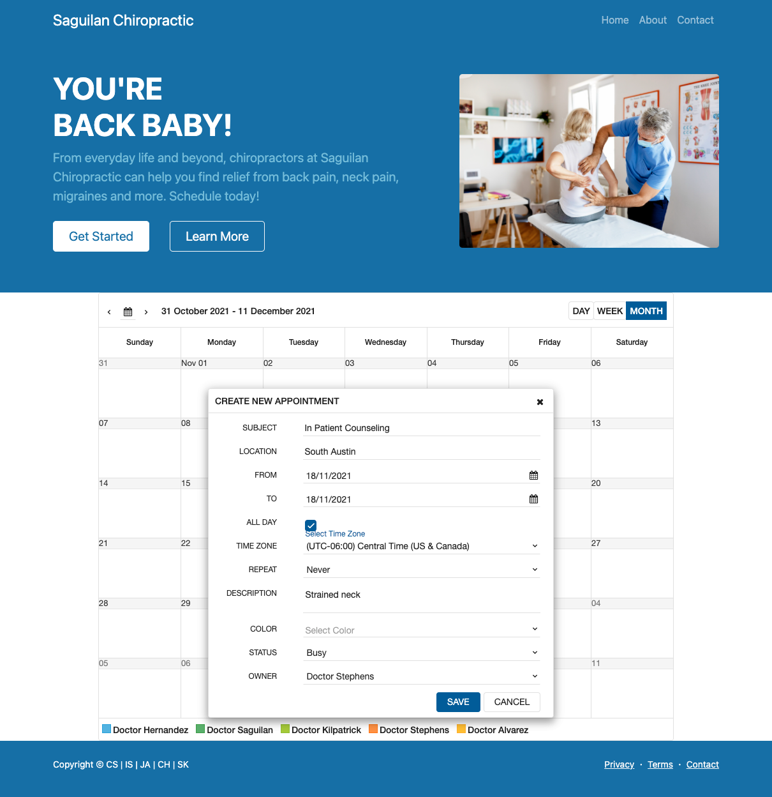

# Project_2

## Description
 

## Table of contents
  - [Installation](#installation)
  - [Usage](#usage)
  - [Credits](#credits)
  - [License](#license)
  - [Test](#test)
  - [Questions](#questions)
  

## Installation
URL link  : ***INSERT URL HERE*** 

 
 

 
 

## Usage

## Credits
This website was built using:  
Bootsrap v4.6x  
Handlebars  
jQWidgets  

## License

## Contributions
Chuck Stephens: https://github.com/chuck2076  
Ismeny Saguilan: https://github.com/Ismeny  
Jesse Alvarez: https://github.com/Jalvarez025  
Carlos Hernandez: https://github.com/Mrher13  
Sam Kilpatrick: https://github.com/samkilpatrick903  

## Test
n/a
## Questions
Have any questions or ideas on how to improve our site? Please email us:  

Chuck Stephens: chuckstephens2076@gmail.com  
Ismeny Saguilan: menysag2@gmail.com  
Jesse Alvarez: jalvarez025@yahoo.com  
Carlos Hernandez: carlos.hernandez498@gmail.com  
Sam Kilpatrick: samkilpatrick903@gmail.com  